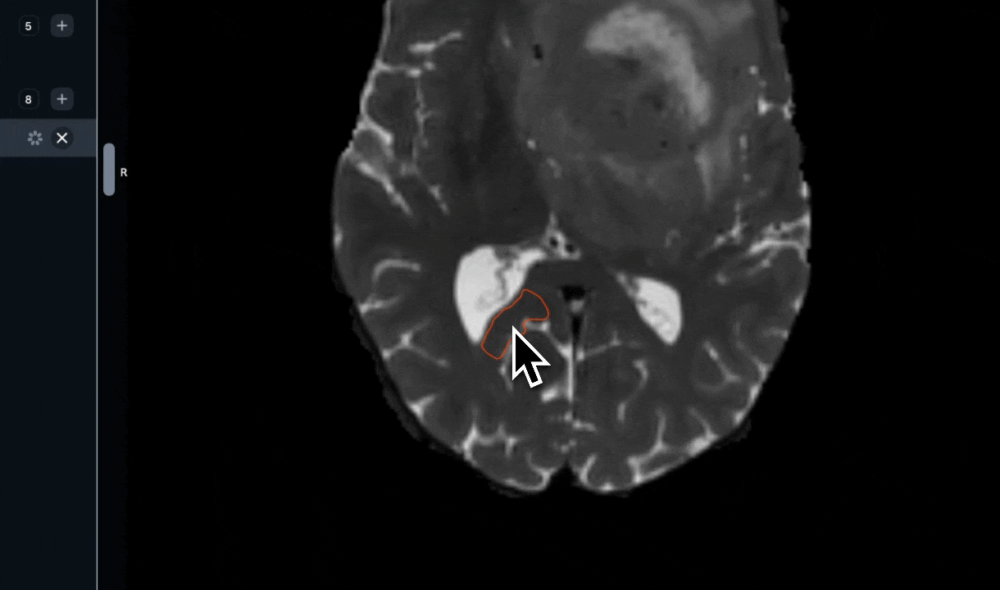

# Segmentation Tools

## Brush Tool

The Brush Tool has two modes - 2D and 3D (toggled on the right-side panel). The 2D brush is a circle, and the 3D brush is a sphere that segments across slices. You can adjust the size of the brush using the slider in the right hand Context Panel or the `W` & `S` hotkeys.&#x20;


`Left click + drag` to segment and `right click + drag` to erase.



Brush Tool Overview


***

## Adaptive Brush

The Adaptive Brush automatically defines the edges of the structure you are annotating, resulting in a smarter and more accurate workflow.

The Adhesion parameter allows you to determine how "strict" the Adaptive Brush is with similar intensity values. A lower Adhesion value, for example, would be recommended for annotating regions or structures with smooth gradients, whereas a higher Adhesion value would be best for annotating with sharper gradients.

<figure><figcaption>
The Adaptive Brush in action
</figcaption></figure>


**Adaptive Brush Mastery:** we recommend adjusting your Windowing (and other Visualization) settings along with your Adhesion levels to ensure optimal brush behavior.


***

## Pen Tool

The Pen Tool has two modes - 2D and 3D (toggled on the right-side panel). The Pen Tool allows you to annotate using a free-form contour. In 3D mode, the free-form contour is extruded above and below the current slice.&#x20;


`Left click + drag` to add a segment region and `Right click + drag` to remove a region.



Pen Tool Overview


***

## 3D Scissor Tool

The Scissor tool allows you to erase the unwanted section of your segmentation in the 3D view plane.&#x20;


Left click + Drag to erase the unwanted section




***

## Region Growing (Grow Tool)

The Grow Tool is a semi-automated tool that uses image intensity information to segment regions. By clicking and holding in a region, the segmentation will grow outward from the point that you clicked on. The longer you hold, the longer the region will grow.&#x20;


`Left click + hold (+ drag)` to segment, `right click + hold (+ drag)` to erase.



Grow Tool Overview


***

## Contour Tool

The contour tool lets you interact with masks as _contours_. Interacting with masks as contours gives you special tools to create and edit annotations.&#x20;

### Creating a contour from scratch.&#x20;

Select the contour tool, and click and drag on the canvas to draw a contour. To complete the contour, simply intersect the initial node or any other edge of the contour.&#x20;



### Editing existing masks as contours

* **Node edit.** Select an existing mask and select the contour tool. When you hover over an edge, you will see a node with a "target spline" appear. You can drag this node to edit the "target spline" area interactively.



* **Edge redraw.** You can redraw any edge by simply "overwriting" the edge by intersecting it two times.&#x20;



***

## Edge Selection

The Edge Selection Tool is a semi-automated tool that uses pixel intensity information to automatically generate a contour around a designated region of interest.

To use the Edge Selection Tool:&#x20;

* Hover your mouse over the border of a region to generate a preview contour.
* Use `LMB/left click` to generate a contour based on your preview. (Or, `RMB/right click` to erase a contour).
* **Without releasing `LMB`**, drag your mouse away from the click point to smooth the edge of your contour.
* Once your contour has been generated and smoothed to your liking, release `LMB`.



***

## Interpolate

The Interpolate Tool allows you to quickly generate contours across a range of slices and is an excellent way to quickly generate accurate 3D annotations. In order to use the Interpolate Tool:&#x20;

1. Create a new Entity and generate two annotation masks using any Segmentation Tool (for example, create a mask on Slice 70 and a mask on Slice 80)
2. Select the Interpolate Tool
3. Navigate to Slice 70 and hover over the annotation mask. Once the edge glows red, use `LMB/left click` to select it.
4. Repeat Step (3) with the mask on Slice 80.
5. Voila! The Interpolate Tool has generated annotations on all slices between Slice 70 and Slice 80.




**RedBrick Mastery:** Activating **Cineloop** will display the Cineloop Player, which makes it much easier to keep track of where the interpolated segmentation masks are in your image.&#x20;


***

## Hole Filling Tool

The Hole Filling Tool iteratively fills small holes in your segmentation. Click anywhere on the canvas to start filling in small holes.


The Hole Filling Tool is designed to fill small holes. For larger holes, you may need to run the Hole Filling Tool more than once (i.e. click several times).&#x20;



Hole Filling Overview



For large volumes, 3D hole filling can be very computationally expensive. If your data has more than 800 slices, we recommend only using 2D hole filling.


***

## Paint Bucket Tool

The Paint Bucket is helpful for closing single large holes. With the paint bucket tool selected, click in any large hole to fill it automatically.&#x20;

***

## Island Removal Tool

Island Removal deletes "islands" of segmentations. Simply click on any island segmentation to remove it.&#x20;

Conversely, you can enable **Keep Currently Selected** in the right hand Context Panel to remove all of the islands **except** the one you clicked on.


Island Tool Overview


***

## Boolean Operator Tool

The Boolean Operator Tool allows you to perform four operations on segmentations: Copy, Add, Subtract, and Merge.

### Copy Tool

The Copy Tool allows you to transform a segmentation into a perfect copy of another.&#x20;

With Segmentation X selected, enable the Copy Tool and click on Segmentation Y to create a perfect copy of Segmentation X that occupies the same space.

<figure><figcaption>
The Copy Tool in action
</figcaption></figure>

### Add Tool

The Add Tool allows you to add the pixel values of a segmentation to another.&#x20;

With Segmentation X selected, enable the Add Tool and click on Segmentation Y to add the pixel values of Segmentation Y to Segmentation X.

### Subtract Tool

The Subtract Tool allows you to remove the pixel values of a segmentation from another segmentation.

With Segmentation X selected, enable the Subtract Tool and click on Segmentation Y to remove the pixel values of Segmentation Y from Segmentation X.

### Merge Tool

The Merge Tool allows you to transform one type of segmentation island into another.&#x20;

With Segmentation X selected, enable the Merge Tool and click on an island of Segmentation Y to merge the island to Segmentation X.&#x20;


Add, Subtract, and Merge Tool Tutorial


***

## Fast Automated Segmentation Tool (F.A.S.T. ⚡️)

The Fast Automated Segmentation Tool (F.A.S.T.) is an automatic segmentation tool powered by Meta AI's Segment Anything Model that allows users to rapidly generate 2D and 3D segmentations.&#x20;


F.A.S.T. Overview


F.A.S.T. is powerful because of the way users can prompt the tool to generate an accurate segmentation in real time. Under the hood, there are two components to the system:

1. **Image encoding**, which takes place on the server side. The result of image encoding is _embeddings_, which are special vector representations of the images that are useful for machine learning.
2. **Segmentation decoding**, which takes place in the browser in real time.


**To enable F.A.S.T. for your team**, please do the following:&#x20;

1. Request access at https://redbrickai.com/fast or reach out to support@redbrickai.com.
2. Within a Project, navigate to the [Tool Settings page](segmentation-tools.md#tool-configuration) and enable F.A.S.T. in the desired mode (i.e. 2D or 3D).&#x20;


### Generating 2D Segmentations with F.A.S.T.

To start segmenting, create a segmentation instance, select the F.A.S.T. tool from the top bar or using `cmd/ctrl + b`. Once the tool is selected, hover over a viewport to start embedding computation for a single slice (you will see a loader spinner on the top right of the viewport). You can prompt F.A.S.T. in a few different ways after the embedding computation is complete:&#x20;

1. **Bounding Box prompts.** `Click + move mouse + click` to draw a bounding box. You will see the segmentation prediction compute in real time while you draw the bounding box.&#x20;
   1. Once you are happy with the segmentation preview, confirm it by using the button on the right panel or `shift + enter`.
2. **Instant click.** `alt/option + hover` over objects to view a prediction preview. If you are satisfied with any preview, click while pressing `alt/option` to confirm the segmentation.&#x20;

### Interpolating 2D Segmentations with F.A.S.T.

Interpolated F.A.S.T. allows users to draw Bounding Boxes to define an interpolation range for a 3D structure that is to be annotated.

The process for creating interpolated annotations with 2D F.A.S.T. is detailed below.

1. Create a new Instance of your desired Object Label by clicking on the “+” in the left hand toolbar
2. Select F.A.S.T. in the top of the screen and wait for the embedding computation to complete on Slice X
3. Ensure that your F.A.S.T. is set to "2D" mode in the righthand Context Panel
4. Create a Bounding Box around the structure you wish to annotate
5. Navigate to the end of the range that you want to interpolate across (i.e., Slice Y)
6. Repeat Step 3 (and optionally, Step 4) for the structure you wish to annotate on Slice Y
7. Once you are satisfied with the annotations, press Enter or click on “Finalize” in the right hand toolbar to generate the pixel masks on every slice between Slice X and Slice Y.


Processing times may increase when interpolating across large ranges. However, please note that all subsequent work across the same range should be much faster, as the embedding computations only have to be computed once per slice.



Firewalls, ad blockers, privacy extensions, and any other browser extensions that block HTTP traffic are known to interfere with FAST.


***

### Dilate & Erode Tool

The Dilate & Erode Tool allows you to expand or shrink the area of a segmentation.

With a segmentation selected, use `left click` to Dilate (grow) the area of the segmentation and `right click` to Erode (shrink).

Use the **Pixels to Change** slider in the right hand Context Panel to control the severity of the dilation or erosion.


The Dilate and Erode Tool in action


***

### Smoothing Tool

The Smoothing Tool helps you remove peaks and valleys in noisy annotations.&#x20;

With the Smoothing Tool selected, use `left click` to remove valleys and `right click` to remove peaks.&#x20;



***

## Mask Propagation Tool

The Mask Propagation Tool, built on SAM2, is an extremely powerful tool intended for rapid generation of 3D segmentations. To use the Mask Propagation Tool, ensure you have F.A.S.T. (RedBrick Boost) enabled for your Organization and complete the following steps in the Editor:

1. Navigate to a relatively central slice of an ROI you wish to annotate.
2. Annotate a single slice using any Segmentation Tool (e.g. Edge Selection, Adaptive Brush, etc.). After you have created an annotation mask, the Mask Propagation Tool icon will appear.
3. Click on the Mask Propagation Tool icon in the top toolbar. The loader icon (a red or green icon in the top-right corner of your viewport) should begin spinning as the Mask Propagation Tool prepares your Series.
4. (Optional) if the loader icon in the top-right corner of your viewport remains red, click on it to restart it. Once the loader icon is green, you can proceed.
5. In the righthand Context Panel, define the range of slices corresponding to your ROI.
   1. Note that the annotation mask you created in Step (2) **should still be in the center of your slice range**. For example, if you want to propagate a segmentation across slices 10-20, the "test" annotation that you created in Step (2) should be on slice 15.
6. Click on **Propagate Mask** (or use the preferred hotkey). The Mask Propagation Tool will begin processing the ROI in the defined slice range.
7. Once you are satisfied with the preview, click on **Finalize**.


For trickier ROIs, you can use **Finalize Slice** to rasterize a mask on a single slice, touch up the finalized slice mask with the Segmentation Toolkit (e.g. Brush Tool, Contour Tool, etc.) and re-feed it back to the Mask Propagation Tool as input.


Please see the following video for a visual walkthrough of the above steps:


An in-Editor walkthrough of the Mask Propagation Tool


***

## Tool Configuration

Your labeler toolkit can be customized at the Project level by navigating to the **Tool Settings** page within your Project Settings.

Simply utilize the checkboxes for each tool to:

* set a custom default tool;
* restrict/enable 2D and/or 3D annotation;
* set a default mode (i.e. 2D or 3D);
* enable/disable a Tool entirely;

<figure><figcaption></figcaption></figure>
