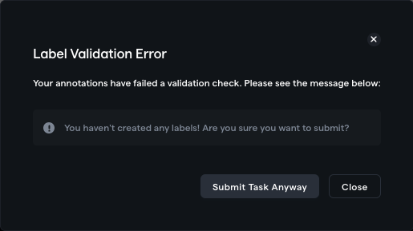
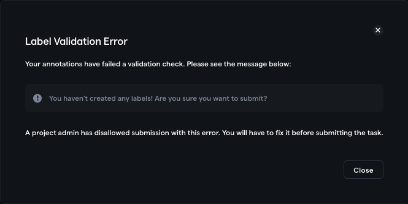
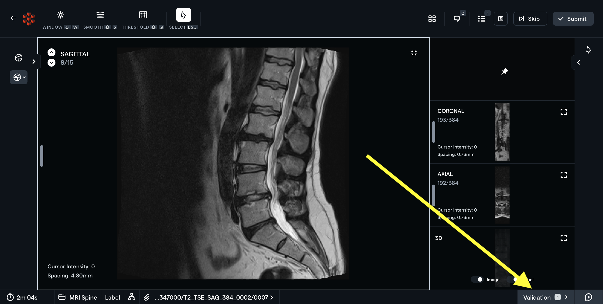

# Custom Label Validation

You can define a custom Javascript script that can continuously compare annotations to a schema/set of rules and inform annotators (in real-time) of any mistakes in their annotations. You can also prevent annotators from submitting tasks when your validation script finds errors.

For most annotation projects, there is a schema/rule-set/taxonomy that annotators must follow. A large portion of errors in annotation projects is due to oversights/slips during labeling in adhering to the schema. \
\
For example, the annotator must segment a tumor and fill out a few related attributes if a tumor is found. A common error can be forgetting to fill out all attributes when the tumor is present. Post-processing scripts usually reveal these errors.&#x20;

Prevent simple, recurrent errors from occurring by writing a set of tests that will be run regularly, informing annotators of any mistakes they're making.


Overview of custom label validation


## Overview

By default, all projects have a custom check to warn annotators when they submit tasks without any annotations. You can enable/disable custom validation under Project Settings -> Label Validation.&#x20;

<figure><figcaption><p>Custom label validation in settings</p></figcaption></figure>

### Prevent Submissions with Errors

By default, annotators will just receive the error messages as a warning, and they will still be able to submit the task anyway. To prevent the annotators from submitting with any errors present, toggle the _Prevent submission with errors_ switch.

<div><figure><figcaption><p>Submission allowed</p></figcaption></figure> <figure><figcaption><p>Submission with errors prevented</p></figcaption></figure></div>

### Custom Javascript function

You will write the custom validation as a Javascript function. This Javascript function will run on each annotator's browser while they are annotating data. \
\
The Javascript function has the following definition:&#x20;

```typescript
function(task: Task, labels: Label[]): string[]  {
  // Your custom validation logic
  assert(false, "This assertion was false");
}
```

#### `label: Label[]`

The validation function has a single input - a list of labels containing minimal meta-data about the labels. Please see the definition of the `Label` object below:&#x20;

```typescript
interface Label {
  category: string[];
  attributes: LabelAttribute[];
  labelType: TaskType;
  numFramesLabeled?: number;
  instanceTracks?: { [name: string]: FrameState[] };
  seriesIndex?: number;
}

// Label attribute
interface LabelAttribute {
  name: string;
  value: boolean | number | string;
}

// Task Type
enum TaskType {
  ITEMS = 'ITEMS',
  CLASSIFY = 'CLASSIFY',
  BBOX = 'BBOX',
  POLYGON = 'POLYGON',
  POLYLINE = 'POLYLINE',
  POINT = 'POINT',
  ELLIPSE = 'ELLIPSE',
  SEGMENTATION = 'SEGMENTATION',
  MULTI = 'MULTI',
  MULTICLASSIFY = 'MULTICLASSIFY',
  LENGTH = 'LENGTH',
  ANGLE = 'ANGLE',
}


interface Task {
    orgId: string;
    projectId: string;
    stageName: string; // i.e. "Label" or "Review_1"
    taskId: string;
    name: string; // Name given for the task at upload
    metaData: Record <string, any>;
    classification?: Classification;
    series: Series[];
}

interface Series {
  name: string;
  metaData: Record <string, any>;
  dimensions: [number, number, number];
  
  classifications?: Classification[];
  instanceClassifications?: InstanceClassification[];

  landmarks?: Landmark[];
  landmarks3d?: Landmark3D[];
  measurements?: (MeasureLength | MeasureAngle)[];
  boundingBoxes?: BoundingBox[];
  cuboids?: Cuboid[];
  ellipses?: Ellipse[];
  polygons?: Polygon[];
  polylines?: Polyline[];

  segmentMap?: {
    [instanceId: string]: {
      category: Category;
      attributes?: Attributes;
      overlappingGroups?: number[];
    };
  };
}


interface VideoMetaData {
  frameIndex: number;
  trackId: string;
  keyFrame: boolean;
  endTrack: boolean;
}

interface Classification {
  attributes: Attributes;
  video?: VideoMetaData;
  group?: string;
}

interface InstanceClassification {
  fileIndex: number;
  values: Attributes;
  group?: string;
}

interface MeasurementStats {
  average?: number;
  area?: number;
  volume?: number;
  minimum?: number;
  maximum?: number;
}

interface Landmark {
  point: Point2D;
  category: Category;
  attributes?: Attributes;
  video?: VideoMetaData;
  group?: string;
}

interface Landmark3D {
  point: VoxelPoint;
  category: Category;
  attributes?: Attributes;
  group?: string;
}

interface MeasureLength {
  type: 'length';
  point1: VoxelPoint;
  point2: VoxelPoint;
  absolutePoint1: WorldPoint;
  absolutePoint2: WorldPoint;
  normal: [number, number, number];
  length: number;
  category: Category;
  attributes?: Attributes;
  group?: string;
}

interface MeasureAngle {
  type: 'angle';
  point1: VoxelPoint;
  point2: VoxelPoint;
  vertex: VoxelPoint;
  absolutePoint1: WorldPoint;
  absolutePoint2: WorldPoint;
  absoluteVertex: WorldPoint;
  normal: [number, number, number];
  angle: number;
  category: Category;
  attributes?: Attributes;
  group?: string;
}

interface BoundingBox {
  pointTopLeft: Point2D;
  wNorm: number;
  hNorm: number;
  category: Category;
  attributes?: Attributes;
  stats?: MeasurementStats;
  video?: VideoMetaData;
  group?: string;
}

interface Cuboid {
  point1: VoxelPoint;
  point2: VoxelPoint;
  absolutePoint1: WorldPoint;
  absolutePoint2: WorldPoint;
  category: Category;
  attributes?: Attributes;
  stats?: MeasurementStats;
  group?: string;
}

interface Ellipse {
  pointCenter: Point2D;
  xRadiusNorm: number;
  yRadiusNorm: number;
  rotationRad: number;
  category: Category;
  attributes?: Attributes;
  stats?: MeasurementStats;
  video?: VideoMetaData;
  group?: string;
}

interface Polygon {
  points: Point2D[];
  category: Category;
  attributes?: Attributes;
  stats?: MeasurementStats;
  video?: VideoMetaData;
  group?: string;
}

interface Polyline {
  points: Point2D[];
  category: Category;
  attributes?: Attributes;
  video?: VideoMetaData;
  group?: string;
}

// i is rows, j is columns, k is slice
interface VoxelPoint {
  i: number;
  j: number;
  k: number;
}

// The position of VoxelPoint in physical space (world coordinate) computed using the Image Plane Module
interface WorldPoint {
  x: number;
  y: number;
  z: number;
}

interface Point2D {
  xNorm: number;
  yNorm: number;
}

type Category = string;
type Attributes = { [attributeName: string]: string | boolean | string[] };

```

You can generate a sample `Label[]` object by going to the labeling tool -> opening command bar `cmd/ctrl + k` -> _Copy current label state to clipboard._



#### Returns `string[]`

Your custom validation script must return a list of warning/error messages describing the issues found. Return an empty array `[]` if no errors are found. These error message strings will be displayed to the annotators on the labeling tool.&#x20;

To help you write a validation function with several checks, RedBrick AI has a custom-defined function `assert` that accepts a boolean statement and a corresponding error message. The two scripts below will produce the same result:&#x20;



<pre class="language-typescript"><code class="lang-typescript"><strong>function(task: Task, labels: Label[]): string[] {
</strong>    assert(labels.length >= 1, "You have not created any labels!");
    assert(labels.length &#x3C;= 5, "You have created too many labels!");
}
</code></pre>



```typescript
function(task: Task, labels: Label[]): string[] {
    const errors = [];
    
    if (labels.length < 1) {
        errors.push("You have not created any labels!");
    }
    if (labels.length > 5) {
        errors.push("You have created too many labels!");
    }
    
    return errors;
}
```



## Validate Your Code

Before saving your script, you should validate that your code executes as expected. Click on the validate button on the bottom right of the Settings page, and paste the JSON object copied from the labeling tool to see if your code executes as expected:

<figure><figcaption></figcaption></figure>

## Displaying the Validation on the Labeling Tool

Your custom validation script will be regularly run. If any warnings are found, an indicator will appear on the right side of the bottom bar. If you have enabled **Prevent submissions with errors**, the indicator will be red.&#x20;

<figure><figcaption><p>Submission with errors is allowed</p></figcaption></figure>

<figure><figcaption><p>Submission with errors is prevented</p></figcaption></figure>

## Example Scripts

### Check if Exact Categories are Present

For this example, let's say we are expecting each task to contain the following segmentations - _necrosis, enhancing tumor, non-enhacing tumor and edema._&#x20;

```typescript
function(task: Task, labels: Label[]): string[] {
  const expectedCategories = [
    'necrosis',
    'enhancing tumor',
    'non-enhancing tumor',
    'edema',
  ];

  // Iterate over all expected categories
  for (const category of expectedCategories) {
  
    // Check if the category is present in any label
    const categoryPresent = labels.some(
      (label) => label.category[0] === category
    );
    
    // assert with message
    assert(categoryPresent, `The ${category} category is missing!`);
  }
}
```

### Validate Only Single Instance of a Category has been Created

This script validates only a single instance of a particular category has been created. If you're expecting semantic segmentation labels, this check can ensure annotators don't accidentally create multiple instance segmentations.

```typescript
function(task: Task, labels: Label[]): string[] {  
  const semanticCategory = 'edema';

  const labelsFiltered = labels.filter((label) => label.category[0] === semanticCategory);

  assert(
    labelsFiltered.length === 1,
    `Expected exactly 1 ${semanticCategory} annotation`
  );
}
```

### Verify that Specific Segmentation Type is Visible on Specific Series

The following script examines the Series Identifier and verifies whether a specific Segmentation type is present on it. In this example, you could use this script to be sure that labelers cannot finalize a Series that ends in "DWI" (a common naming convention for DWI images) without including an "Infarct" segmentation on the Series.

More broadly speaking, this script is an example of the extensive functionality available when combining the `label`, `task`, and `series` objects.

```javascript
function (task: Task, labels: Label[]): string[]  {
  assert(labels.length > 0, "You haven't created any labels! Are you sure you want to submit?");
  for (let label of labels) {
    if (label.category[0] === "Infarct") {
      assert(
        task.series[label.seriesIndex].name.startsWith("DWI_"),
        "Segmentation 'Infarct' is allowed only on 'DWI' images"
      );
    }
  }
}
```
